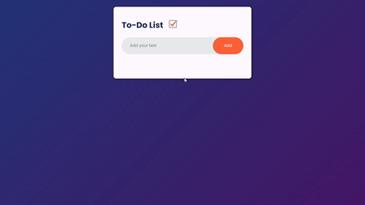

# To-Do List with React

Lista de tarefas feita com React onde os dados são armazenados no *localStorage* do navegador.

## &#x1F5A5; Tecnologias Usadas
&nbsp;
&nbsp;
&nbsp;
&nbsp;

## &#x1F517; URL do Projeto
[Projeto Hospedado na Vercel](https://to-do-with-react-ten.vercel.app/)
